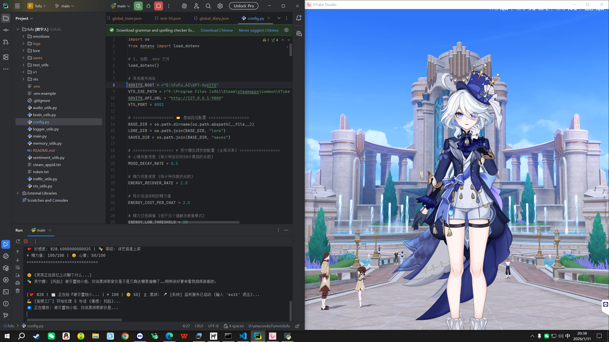

# 🎭 Furinga AI - 芙宁娜数字伴侣 (Ver 0.1)

> "哼，既然你诚心诚意地请求了，本芙宁娜就大发慈悲地陪你说说话吧！"

[](https://www.python.org/)
[](https://denchisoft.com/)
[](https://www.deepseek.com/)
[](https://github.com/RVC-Boss/GPT-SoVITS)

**Furinga AI** 是一个基于大语言模型和语音合成技术的桌面数字人伴侣项目。她拥有长短期记忆、情感系统，能通过 VTube Studio 进行生动的动作演绎，并具备独立的生活流逻辑。



## ✨ 核心功能

* **🧠 深度思考**：接入 **DeepSeek** 大模型，拥有符合芙宁娜人设的对话逻辑，懂梗、傲娇、会吐槽。
* **🗣️ 情感语音**：集成 **GPT-SoVITS**，根据对话情感自动切换语气（傲娇、害羞、生气、撒娇等），告别棒读。
* **💃 动作联动**：通过 WebSocket 连接 **VTube Studio**，说话时自动同步嘴型，并根据情感触发“叉腰”、“托脸”、“惊讶”等 Live2D 动作。
* **📝 长期记忆**：拥有 RAG (检索增强生成) 记忆系统。她会记得你的名字、你们养的猫（小幸运）、你的职业设定，甚至记得几天前聊过的话题。
* **⏳ 生活流系统**：当你不在时，她会自己安排生活（看剧本、吃甜点、发呆），并会在你回来时主动报备刚才做了什么。
* **💖 好感度机制**：内置好感度与等级系统（从“陌生人”到“无法替代的存在”），解锁不同的语音风格和互动彩蛋。

## 🛠️ 技术架构

* **LLM**: DeepSeek API
* **TTS**: GPT-SoVITS (本地部署)
* **Frontend**: VTube Studio (Live2D 模型展示)
* **Audio**: Pygame + VBCABLE (虚拟声卡路由)
* **Logic**: Python (Asyncio 异步处理)

## 🧩 系统构成

本项目致力于打造一个完整的“数字生命体”，由以下五个核心模块组成：

* **大脑 (Brain)**：由 **DeepSeek** 驱动，负责思考、决策、玩梗和情感分析。
* **嘴巴 (Mouth)**：独立运行的 **GPT-SoVITS**，提供低延迟、高还原度的芙宁娜语音。
* **身体 (Body)**：通过 **VTube Studio** 实现 Live2D 动作同步，甚至能根据心情做表情。
* **记忆 (Memory)**：基于 **RAG (向量检索)** 的长期记忆库，永远记得你和她的小秘密。
* **生活 (Life)**：独立的生活流系统，在你离开时，她也会有自己的时间流逝和活动。

##  安装指南
### 1. 基础准备
* **系统**：推荐 Windows 10/11
* **软件**：
    * [Python 3.10+](https://www.python.org/downloads/)
    * [VTube Studio](https://store.steampowered.com/app/1325860/VTube_Studio/) (Steam下载)
    * [VB-Audio Cable](https://vb-audio.com/Cable/) (虚拟声卡，用于让 VTS 听到芙宁娜说话并对口型)

### 2. 获取代码
```bash
git clone [https://github.com/PanJunqi0331/Furinga-AI-V0.1.git](https://github.com/PanJunqi0331/Furinga-AI-V0.1.git)
cd Furinga-AI-V0.1
pip install -r requirements.txt
```

### 3. 部署语音后端 (GPT-SoVITS)
本项目采用**轻量化设计**，不直接包含巨大的语音模型环境。你需要手动配置：

1.  **下载 GPT-SoVITS 整合包**：[前往下载](https://github.com/RVC-Boss/GPT-SoVITS)
2.  **解压**：建议解压到项目同级目录（例如 `E:\GPT-SoVITS`）。
3.  **下载芙宁娜模型**：
    * 将芙宁娜的 `.pth` 模型放入项目的 `SoVITS_weights/` 文件夹。
    * 将芙宁娜的 `.ckpt` 模型放入项目的 `GPT_weights/` 文件夹。

### 4. 配置文件
1.  **API 密钥设置**：
    将项目根目录下的 `.env.example` 重命名为 `.env`，用记事本打开并填入你的 DeepSeek Key：
    ```ini
    DEEPSEEK_API_KEY=sk-xxxxxxxxxxxx
    ```

2.  **路径配置**：
    打开 `config.py`，找到并修改以下几行，指向你第3步下载的实际位置：
    ```python
    # ⚠️ 重要：这里要填你 GPT-SoVITS 整合包的绝对路径
    SOVITS_ROOT = r"E:\GPT-SoVITS"
    
    # 这里填你的模型文件名（如果文件名不同请修改）
    SOVITS_MODEL_PATH = "SoVITS_weights/furina_e8.pth"
    GPT_MODEL_PATH = "GPT_weights/furina-e15.ckpt"
    ```

### 5. 音频设置 (关键步骤！)
为了让 VTube Studio 能准确对口型：
1.  安装 **VB-Audio Cable**。
2.  将电脑的 **“默认播放设备”** 保持不变（你的扬声器）。
3.  本程序会自动将语音输出到默认设备，同时 VTube Studio 需要监听麦克风。
4.  *(进阶推荐)*：如果想效果更好，可以在代码中配置音频输出到 `CABLE Input`，然后在 VTube Studio 中选择 `CABLE Output` 作为麦克风。

### 6：导入 Live2D 模型
为了让 VTube Studio 识别芙宁娜，你需要手动放入模型文件：
1.  找到本项目中的 `vts` 文件夹（或者包含 `.moc3` 文件的模型文件夹）。
2.  打开 VTube Studio，点击左侧菜单的第一个人头图标 -> "导入模型" -> "打开文件夹"。
3.  这会打开 VTube Studio 的 `Live2DModels` 目录。
4.  将本项目中的芙宁娜模型文件夹整体**复制**进去。
5.  重启 VTube Studio，你就能在列表中看到芙宁娜了！

### 7. 启动！
1.  打开 **VTube Studio**，加载芙宁娜模型。
2.  在 VTS 设置中开启 **API 开关** (端口 8001)。
3.  运行主程序：
    ```bash
    python main.py
    ```
4.  观察控制台，当看到 `API启动成功` 字样时，芙宁娜就会开始自言自语或等你说话了！

## 📂 目录结构

```text
Furinga-AI/
├── main.py              # 🚀 主程序入口 (启动这个！)
├── config.py            # ⚙️ 全局配置文件 (路径、API Key)
├── brain_utils.py       # 🧠 大脑 (LLM 交互、决策与玩梗逻辑)
├── audio_utils.py       # 🗣️ 嘴巴 (TTS 生成、音频播放管理)
├── vts_utils.py         # 💃 身体 (VTube Studio 连接与动作控制)
├── memory_utils.py      # 📘 记忆 (RAG 向量检索、长期记忆存储)
├── sentiment_utils.py   # ❤️ 情感 (情绪分析与好感度计算)
├── lore/                # 📜 设定集 (芙宁娜的人设提示词)
├── saves/               # 💾 存档 (聊天记录、用户记忆)
└── vts/                 # 🎨 模型配置 (VTS 模型动作映射表)
```

## ❓ 常见问题 (FAQ)

**Q: 运行报错 `ModuleNotFoundError`？**
A: 请确保你已经运行了 `pip install -r requirements.txt`，并且是在正确的 Python 环境下运行。
推荐使用国内镜像源安装 (速度更快)。pip install -r requirements.txt -i https://pypi.tuna.tsinghua.edu.cn/simple

**Q: VTube Studio 里模型嘴巴不动？**
A: 
1. 检查 VBCABLE 是否安装并启用。
2. 检查 VTube Studio 设置 -> 麦克风设置，是否选用了 `CABLE Output`。
3. 检查控制台是否有 `[VTS] 连接成功` 的提示。

**Q: 芙宁娜说话没声音？**
A: 请检查电脑右下角的音量图标，确保“默认播放设备”是你正在使用的扬声器/耳机，而不是 CABLE Input。

## 🤝 致谢

本项目是站在巨人的肩膀上完成的，特别感谢以下模型作者提供的优质素材，以及开源社区的贡献：

### 🎨 模型素材 (Special Thanks)
* **🗣️ 语音模型 (Voice)**: 感谢 B站UP主 **@TinyLight微光小明** 提供的 GPT-SoVITS 芙宁娜模型。
* **💃 Live2D 模型 (Body)**: 感谢 B站UP主 **@啾咪晏之** 制作的精美 VTube Studio 芙宁娜模型。

### 🛠️ 核心技术
* **[GPT-SoVITS](https://github.com/RVC-Boss/GPT-SoVITS)**: 极其强大的少样本语音转换项目，赋予了芙宁娜灵魂般的声音。
* **[DeepSeek](https://www.deepseek.com/)**: 聪明且高性价比的大语言模型，构成了芙宁娜思考与决策的大脑。
* **[VTube Studio](https://denchisoft.com/)**: 业界领先的 Live2D 面捕软件，提供了灵动的身体表现与 API 接口。
* **[Sentence-Transformers](https://www.sbert.net/)**: 提供了强大的本地语义分析能力，让芙宁娜能听懂情绪。

---
*本项目仅供技术学习与交流，请勿用于非法用途或商业盈利。*
*Made with ❤️ by [你的名字]*
